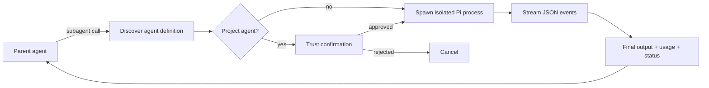
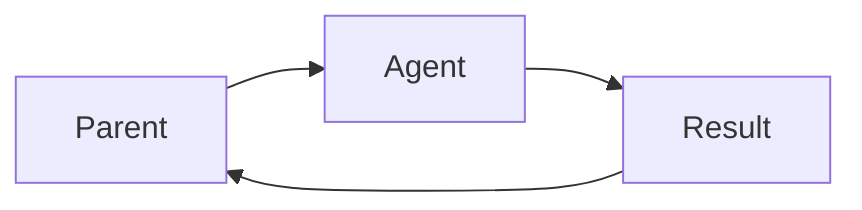
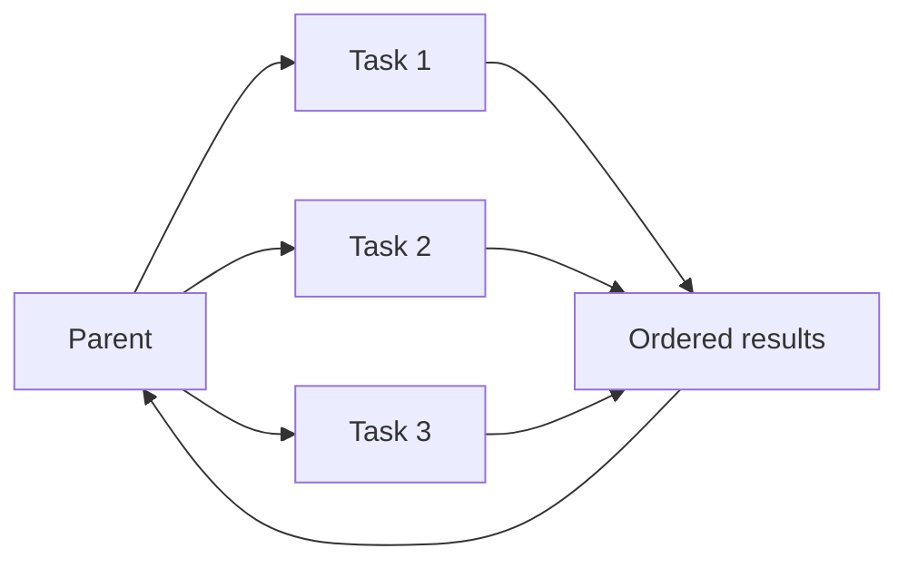
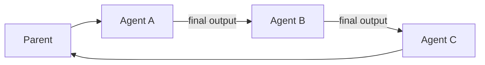
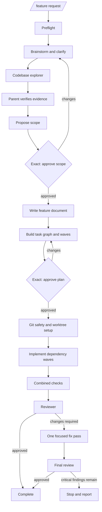
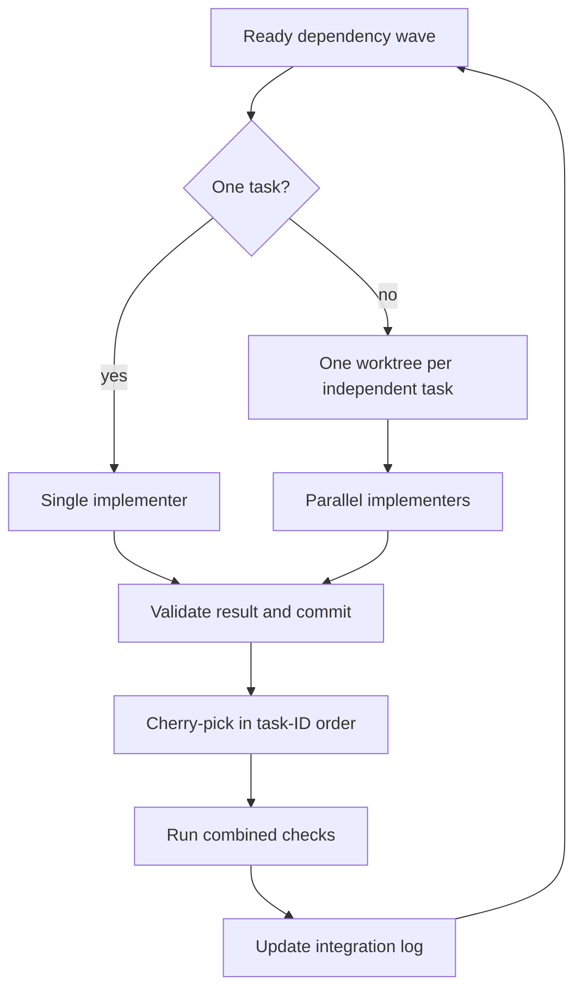

# Subagent extension

Delegates focused work to isolated Pi processes. Each subagent gets its own context, role prompt, model, tools, and working directory; the parent agent remains responsible for orchestration and integration.

## Runtime flow



Every child runs with:

- `pi --mode json -p --no-session --no-extensions --no-skills`
- exactly the role's configured extension and skill paths — never the subagent extension implicitly (see [Per-agent resources](#per-agent-resources))
- the role's system prompt, model selector, and tool allowlist
- the requested `cwd`, or the parent's current directory
- abort propagation from the parent

The extension streams progress and records turns, tokens, cost, context usage, stderr, exit status, and final output.

## Delegation modes

### Single

One focused task in one isolated context.



```json
{
  "agent": "codebase-explorer",
  "task": "Trace the authentication request flow",
  "agentScope": "project"
}
```

### Parallel

Independent tasks run concurrently. Input order is preserved in the combined result.



- Maximum 8 tasks per call
- Maximum 4 running processes at once
- Model-visible output capped at 50 KB per task
- Partial failure is reported without hiding successful results

### Chain

Sequential handoff. `{previous}` in a task is replaced with the prior agent's final output.



The chain stops at the first failed, aborted, or empty result.

## Agent discovery and trust

Agents are Markdown files with frontmatter:

```markdown
---
name: reviewer
description: Reviews an integrated change
tools: read, grep, find, ls, bash
model: openai-codex/gpt-5.6-luna:xhigh
---

Role instructions go here.
```

| Scope | Source | Behavior |
|---|---|---|
| `user` | `~/.pi/agent/agents/*.md` | Default |
| `project` | nearest `.pi/agents/*.md` | Repository-controlled |
| `both` | both locations | Project definition wins on name conflicts |

Interactive calls confirm before running project agents unless `confirmProjectAgents: false` is set. Disable confirmation only after Pi's project trust gate has approved the repository.

## Per-agent resources

Each agent frontmatter declares the parent-loaded extensions and skills it needs:

```markdown
---
name: feature-implementer
model: openrouter/deepseek/deepseek-v4-flash-0731:max
tools: read, grep, find, ls, bash, edit, write, cymbal, exa_contents, exa_search
extensions:
  - "@ff-labs/pi-fff:src"
  - DietrichGebert/ponytail:pi-extension
  - exa-contents
  - exa-search
  - cymbal
skills:
  - ponytail
---

Role instructions go here.
```

### List syntax

- `extensions:` — a YAML array of selectors naming extensions already loaded in the parent.
- `skills:` — a YAML array of exact parent-loaded skill names.
- Absent or empty lists mean no extension or skill resources.
- Any other shape (a scalar, non-string items, empty entries) is a configuration error.

### Parent-loaded resolution

Selectors never install or rediscover resources; they resolve only against what the parent has already loaded:

- Pi-style package selectors match by provenance path, e.g. `@ff-labs/pi-fff:src` and `DietrichGebert/ponytail:pi-extension`; a scheme-prefixed package such as `npm:@ff-labs/pi-fff` also works.
- Unique local names match a single loaded extension entry by directory or file stem, e.g. `cymbal`, `exa-search`, `exa-contents`.
- Skill selectors match parent-loaded skills by exact name, e.g. `ponytail`, `ponytail-review`.
- Missing selectors and ambiguous aliases fail with the available set rather than guessing.

### Pre-spawn failures

Every requested agent is validated before any child process starts. Unknown agent names, malformed resource fields, and missing or ambiguous selectors produce an explicit `Subagent configuration error` and zero spawns — including in parallel and chain calls, where the whole batch is prevalidated up front.

### Exact child isolation

Children spawn with `--no-extensions --no-skills` so discovery cannot leak unconfigured resources in, then receive one explicit `--extension <path>` per resolved extension and one explicit `--skill <path>` per resolved skill. Model, tools, and system-prompt arguments are preserved unchanged, and the subagent extension is never added implicitly. Tool availability is the intersection of the loaded extensions and the role's `tools:` allowlist.

### Checked-in roles

| Agent | Extensions | Skills | Tools |
|---|---|---|---|
| `codebase-explorer` | `@ff-labs/pi-fff:src`, `cymbal` | — | `read, grep, find, ls, cymbal` (read-only) |
| `feature-implementer` | `@ff-labs/pi-fff:src`, `DietrichGebert/ponytail:pi-extension`, `exa-contents`, `exa-search`, `cymbal` | `ponytail` | `read, grep, find, ls, bash, edit, write, cymbal, exa_contents, exa_search` |
| `feature-reviewer` | `@ff-labs/pi-fff:src`, `cymbal` | `ponytail-review` | `read, grep, find, ls, bash, cymbal` (read-only review) |

## Included feature workflow

The extension exposes `.pi/prompts/feature.md` as `/feature`. This workflow uses subagents for evidence gathering, implementation, and review while the parent agent owns decisions, approvals, git state, worktrees, and integration.



### Role focus

| Agent | Focus | Access | Output |
|---|---|---|---|
| `codebase-explorer` | Bounded repository evidence for planning | Read-only: Cymbal, FFF find/grep, file reads | ~800-word evidence packet |
| `feature-implementer` | One approved task with no planning context | Read/write in its assigned checkout | Commit SHA, changed files, checks, blockers |
| `feature-reviewer` | Integrated diff against approved scope and acceptance criteria | Read-only review commands | Coverage, findings, verdict |

### Planning flow

1. Verify model, repository state, instructions, checks, FFF override mode, and Cymbal.
2. Brainstorm until the functional request is clear.
3. Run `codebase-explorer`; the parent verifies its cited evidence. A failed exploration is retried once.
4. Require the exact `approve scope` reply, then create `.pi/features/<slug>.md`.
5. Decompose approved scope into dependency-aware tasks and waves.
6. Require the exact `approve plan` reply before any product-code change.

Material requirement changes invalidate prior exploration and scope approval.

### Execution flow



A task completes only when the implementer returns a successful result and commit. Failed tasks do not unblock dependents. Cherry-pick conflicts are aborted and reported rather than resolved automatically.

### Review boundary

The reviewer runs once after all tasks and checks are integrated. If critical changes are required, the workflow permits one implementer fix pass and one final review—never an unbounded fix/review loop.

The workflow does not automatically merge, push, open a pull request, reset, stash, or delete the integration branch.

## Supporting tools

The extension registers only `subagent` and `check-workflow-deps`:

- `check-workflow-deps` — verifies `PI_FFF_MODE=override`, active FFF `find`/`grep` overrides, and the independently loaded Cymbal tool

Worktree creation and all git integration intentionally remain outside the subagent tool.

## Independent Cymbal loading

The subagent extension does not register `cymbal`. Code navigation comes from `extensions/cymbal/index.ts`, which registers a single read-only `cymbal` tool (allowlisted commands, cancellation, non-zero error propagation, 50 KB output truncation, and concise operating guidance). Load that extension in the parent launch together with this one, and every agent that should navigate with it must select the `cymbal` extension and allowlist the `cymbal` tool. `check-workflow-deps` fails with actionable guidance when the independent Cymbal tool is not active.

## Launch

Required model selectors:

```text
openai-codex/gpt-5.6-sol:medium
openrouter/deepseek/deepseek-v4-flash-0731:max
openai-codex/gpt-5.6-luna:xhigh
```

Start Pi from a repository containing the included `.pi/agents` resources:

```bash
export PI_FFF_MODE=override

pi \
  -e /Users/zero/src/_pi/extensions/subagent/index.ts \
  -e /Users/zero/src/_pi/extensions/cymbal/index.ts \
  --model openai-codex/gpt-5.6-sol:medium \
  --models 'openai-codex/gpt-5.6-sol:medium,openrouter/deepseek/deepseek-v4-flash-0731:max,openai-codex/gpt-5.6-luna:xhigh'
```

Load both the subagent and Cymbal extensions. The parent must also load every extension referenced by a role selector (pi-fff, Ponytail, exa-contents, exa-search) or the corresponding pre-spawn check fails with the available set.

Then run:

```text
/feature <feature idea>
```

Install the required navigation tools before launch:

```bash
pi install npm:@ff-labs/pi-fff
brew install 1broseidon/tap/cymbal
```

## Tests

```bash
node --test extensions/subagent/*.test.ts extensions/cymbal/*.test.ts
```

Tests do not invoke paid model APIs.
